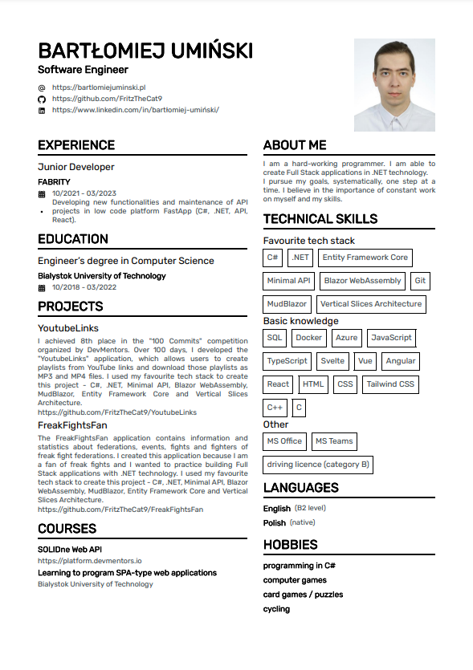

# CV Generator

This is a console application designed for generating a personalized Curriculum Vitae (CV) in PDF format. Using the app, you can easily customize your CV by editing a few files, and the program will create a professional-looking PDF for you.

## Example of Generated CV

Here is an example of my CV, generated using this program:

## How to Generate Your Own CV

Follow these steps to generate your customized CV:

1. **Download the Repository**: Clone or download the repository to your local machine.

2. **Edit the `person.json` File**: 
   - Open the `person.json` file and replace the default data with your personal information. This file includes details like your name, contact information, work experience, education, and other relevant sections.
   
3. **Replace the Profile Picture**:
   - Change the `person.png` image to a picture of yourself.
   - Ensure the image is named `person.png` and placed in `person` folder.

4. **Run the Application**:
   - After making your changes, run the console application. The app will automatically generate your CV.

5. **View the Generated CV**:
   - Your CV will be generated as a PDF file in the `person` folder.
   - The file will be named `FirstName_LastName_CV.pdf` based on the information you provided in the `person.json` file.

## Customization Options

- You can **edit the code** to rename sections or customize them to better fit your style or requirements.
